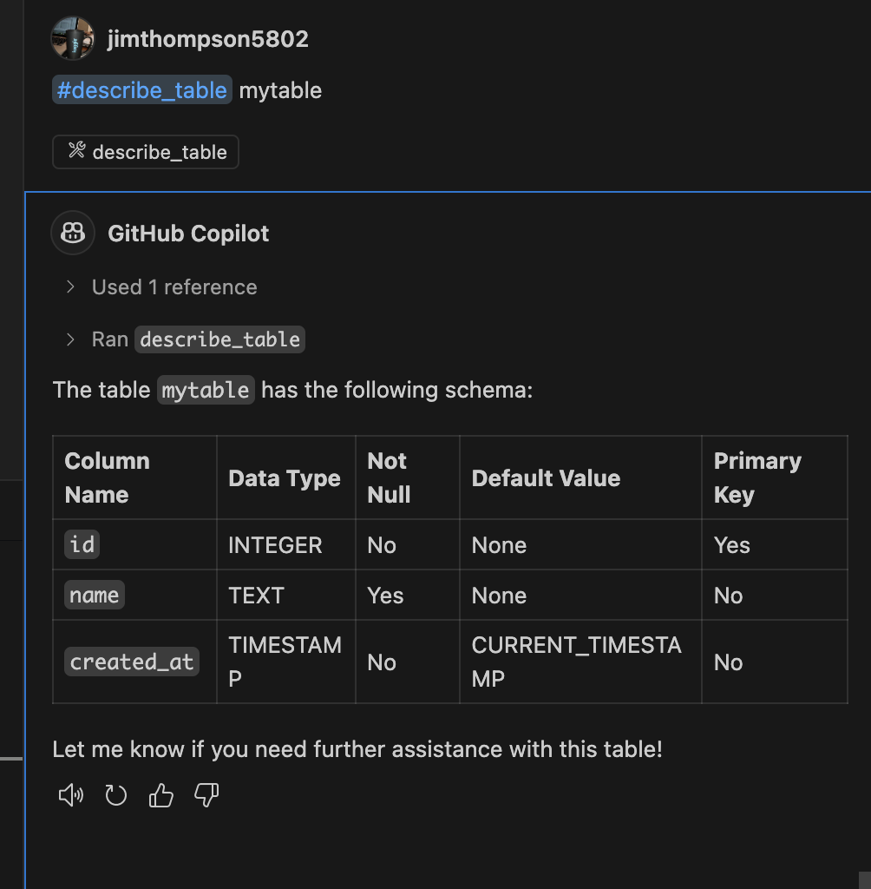

# Product requirements documents for the connection solver.

This directory contains the product requirements documents (PRDs) for the connection solver. 
The PRDs outline the features, functionality, and design of the connection solver. They are intended to provide a clear understanding of the requirements and expectations for the development team.

With the exception of `setup_prd.md`, which was manually created, all other PRDs were created by reverse engineering the existing [Agentic Virtual Agent (AVA) codebase](https://github.com/jimthompson5802/connection_solver).

Before using VSC Agent to generate code from the user stories files, the workspace contained only these files:
- `.github/` contains `copilot-instructions.md` to instruct GitHub Copilot with coding conventions used in this project.
- `.vscode/` contains `launch.json` for running and debugging the code in VSCode.
- `connection_solver_prd/` contains the Product Requirements Documents (PRDs), aka the user stories for the connection solver.
- `puzzle_data/` contains the puzzle data files.
- `.env` symbolic link to enviornment variables required for LLM access.


|User Story|Time for Agent<br>to Generate Code (mm:ss)|Comments|Agent Dialog|Status|
|---|:---:|---|-----|----|
|setup_prd.md|01:30|No issues.|[Setup Dialog](agent_dialog/agent_setup.md)|COMPLETE|
|web_ui_prd.md|4:45<br>1:44|- use of Flask instead of Quart<br>-Agent Refactor from Flask to Quart<br>- web ui working with stub code.|[web ui Dialog](agent_dialog/agent_webui.md)|COMPLETE|
|workflow_prd.md|11:44|-refactor code to correct import error for MemoryCheckpoint class<br>- refactor workflow compilation code.<br>-creates workflow graph in several locations, need to refactor<br>- pip install of pygraphviz for Apple Silicon|[Workflow Dialog](agent_dialog/agent_workflow.md)|REFACTOR IN PROGRESS|
|solver_prd.md||||TO DO|
|tools_prd.md||||TO DO|
|openai_tools_prd.md||||TO DO|

**REFACTOR IN PROGRESS**: With the assistance of GHCP refactoring code by hand to correct logic or run-time errors.

## setup 
```
# custom brewarm for M1/M2 macs
brewarm install graphviz
 
# force source code install to build apple silicon version
pip install --config-settings="--global-option=build_ext" --config-settings="--global-option=-I$(brewarm --prefix graphviz)/include/" --config-settings="--global-option=-L$(brewarm --prefix graphviz)/lib/" --no-binary :all: --force-reinstall --no-cache-dir pygraphviz 
```

`brewarm` is an alias for `/opt/homebrew/bin/brew` command installing Apple Silicon homebrew packages.

## sqlite MCP server

setup a MCP server for `sqlite` database.

Since the dataase is only ephemeral, it is not necessary to persist the database across runs. The MCP server will be run in a docker container with the database stored in `/tmp` directory.  

VSCode settings for the MCP server are stored in `.vscode/mcp.json` file.
```json
{
    "servers": {

        "sqlite": {
            "command": "docker",
            "args": [
                "run",
                "-i",
                "--rm",
                "-v",
                "/tmp:/mcp",
                "mcp/sqlite",
                "--db-path",
                "/mcp/sqlite.db"
            ]
        }
    }
}
```

**Example of using the `sqlite` MCP server with GHCP**:




## Visual Studio Code Agent: Code Generation Dialog with GitHub Copilot

VSC Agent used `claude 3.7 sonnet` LLM for code generation.


#### Code Refactoring Notes:

## `workflow_manager.py`

* After correcting for deprecated (incorrect) and manually installing Apple Silicon version of `pygraphviz` installed, able to display Agent generated workflow graph.

`conection_solver_graph.png`


`connection_solver_webui_graph.png`


---